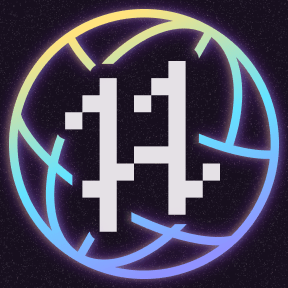

# 👋 Hey there, I'm Saksham!  

  
✨ **Developer | Builder | Learner | Dreamer** ✨  

---

## 🎮 My Contribution Graph (Pac-Man Edition)

<picture>
  <source media="(prefers-color-scheme: dark)" srcset="https://raw.githubusercontent.com/sakshamup-07/sakshamup-07/output/pacman-contribution-graph-dark.svg">
  <source media="(prefers-color-scheme: light)" srcset="https://raw.githubusercontent.com/sakshamup-07/sakshamup-07/output/pacman-contribution-graph.svg">
  
</picture>

---

## 🌟 Hacktoberfest 2025 Achievements  

Here are my **Hacktoberfest 2025 digital badges** 🏆 — earned for contributing to open source and helping the developer community grow!  

  

- 🛠 **Super Contributor** – For consistent, high-quality open-source contributions  
- 🌳 **Plant a Tree** – Supporting sustainability with Tree-Nation 🌱  
- 💫 **Contributor Badges** – Recognizing active participation throughout the event  

---

## 🚀 About Me  

- 💻 Passionate about **Web Development, Open Source, and Automation**  
- 🎯 Currently sharpening my **JavaScript & Python skills**  
- 🌱 Exploring **AI, Backend Development, and System Design**  
- 🎨 Love mixing **creativity with code** to build unique projects  

---

## 🛠️ Tech Stack  

---

## 📊 GitHub Stats  

---

## 🌐 Let's Connect  

  
  
  

---

⭐ From [sakshamup-07](https://github.com/sakshamup-07)
